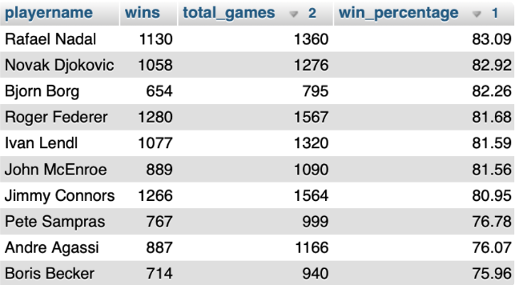

# ATP Data Engineering Project

## Overview

This project focuses on building a complete data pipeline for ATP (men’s professional tennis) data, transforming raw datasets into a structured relational database for analysis.

The workflow includes data ingestion, cleaning, transformation, and relational modeling.

---

## Data Pipeline

The project follows an ETL process:

### 1. Data Ingestion
- Imported raw JSON and CSV datasets into MongoDB

### 2. Data Cleaning & Transformation (MongoDB)
- Removed duplicates and invalid records
- Handled missing values (e.g., height, dates, surfaces)
- Fixed encoding issues in player names
- Normalized attributes (Score, Country, Ground)
- Split composite fields (e.g., Location → City + Country)
- Used aggregation pipelines (`$group`, `$project`, `$merge`)

### 3. Data Migration
- Exported cleaned data to MySQL using Python

### 4. Relational Modeling (MySQL)
- Designed normalized schema:
  - Players
  - Tournaments
  - Player_Per_Game
  - Countries
- Implemented primary and foreign keys

---

## Key Features

- Data cleaning on large-scale dataset (~1M+ records)
- Handling missing and inconsistent data
- MongoDB aggregation pipelines
- Relational database design
- Automated ETL with Python

---

## Example Queries & Results

The structured database enables complex analytical queries on ATP tennis data.

### Top 10 Players by Win Percentage

This query calculates the win percentage of players based on total matches played, filtering those with sufficient match history and ranking them by performance.

### Example Output

The following table shows the top players ranked by win percentage:



---

## Technologies

- MongoDB
- MySQL
- Python

---

## How to Run

1. Import data into MongoDB:

```bash
mongoimport --db ATP --collection matches --file atpplayers.json
